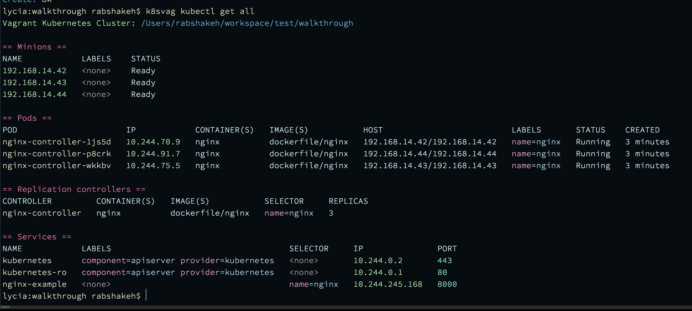
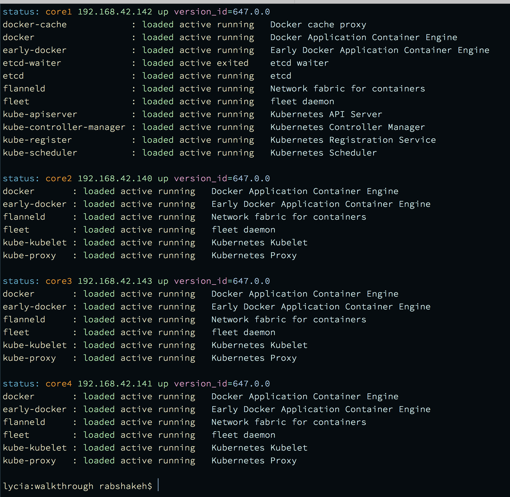

# vckube
Kubernetes Vagrant Provisioning and management script

##Usage
```
pip install vckube

vckube createproject myproject

vckube up myproject

vckube status
```

##Output




##Options
```bash
Vagrant cluster management

Usage:
    cryptobox vagrant [options] [--] <command> [<projectname>] [<args>...]

Options:
    -h --help               Show this screen.
    -p --parallel           Execute commands in parallel, default is serial execution
    -v --verbose            Verbose mode.
    -f --force              Do not ask for confirmation
    -w --wait=<ws>          Wait <ws> seconds between commands.
    -d --workingdir=<wrkd>  Directory to execute commands in, default is current working dir.

Commands:
    ansible        Provision cluster with ansible-playbook(s) [(<labelservers>:<nameplaybook>) ..]
    baseprovision  Apply configuration, createproject calls this.
    coreostoken    Print coreos token to stdout
    createproject  Create a Coreos Kubernetes cluster in local directory
    destroy        Destroy vagrant cluster (vagrant destroy -f)
    halt           Halt vagrant cluster (vagrant halt)
    reload         Reload cluster (vagrant reload)
    reset          Reset cloudconfig settings and replace on cluster, reboots cluster
    ssh            Make ssh connection into specific machine
    sshcmd         Execute command on cluster (remote command)
    status         Status of cluster or machine
    up             Bring cluster up
```

###pip
[https://pypi.python.org/pypi/vckube!](https://pypi.python.org/pypi/vckube)

```
"Programming Language :: Python",
"Programming Language :: Python :: 3",
"Development Status :: 4 - Beta ",
"Intended Audience :: Developers",
"License :: OSI Approved :: GNU Library or Lesser General Public License (LGPL)",
"Operating System :: POSIX",
"Topic :: Software Development :: Libraries :: Python Modules",
"Topic :: System :: Clustering",
"Topic :: System :: Distributed Computing",
"Topic :: System",
```